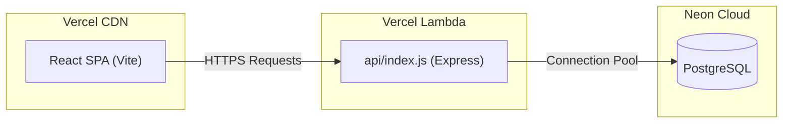

# Build Plan: ExpenseSync (Shared Expenses App)

This build plan outlines the research phase, architectural blueprints, AI development processes, and development trade-offs chosen to execute and scale the ExpenseSync application.

---

## 1. Product Research

### How We Studied Splitwise
We analyzed the core UX and ledger mechanics of Splitwise:
* **Dynamic Calculations**: Tested how Splitwise handles equal splits, custom dollar weights, percentages, and share-based splits.
* **Timeline Constraint Rules**: Examined how groups handle members joining or leaving, observing how bills are allocated based on active membership periods.
* **Settlement Workflows**: Traced how transactions are logged as either expenses (which increase debt) or payments (which settle debt).

### Key Learnings
1. **Zero-Sum Ledger Integrity**: A group's balance sheet is a closed financial system. The sum of all net balances across all members in a group must always equal exactly zero.
2. **Precision & Drift**: Regular divisions (e.g. dividing ₹100.00 among 3 users) yield repeating decimals. Storing splits without rounding allocation policies leads to cents leaking, causing balance mismatches over time.
3. **Timeline Invariants**: In the real world, roommates move in and out. Retroactive CSV imports of expenses must not charge a user for bills dated before they joined or after they left.

### Workflows Identified
* **Expense Log Workflow**: Input description, amount, currency, payer, and split strategy.
* **Ledger Synchronization**: Real-time calculations mapping payments against splits.
* **CSV Bulk Importer**: High-performance parser that runs historical files through 15 validation scanners (identifying duplicates, spelling typo names, timeline mismatches, and messy floats) and prompts users for overrides.

### Product Assumptions Made
* **Static Rates**: USD to INR conversions are snapshotted instantly using a static exchange rate ($1 USD = 84 INR$) for audit safety, rather than resolving dynamic changes historically.
* **Immutable Timeline Logs**: Historic timeline edits do not retroactively modify finalized expenses.

---

## 2. Architecture & Design

### Tech Stack
* **Frontend**: Single Page React Application built with Vite and Tailwind CSS.
* **Backend**: Express.js REST API structured around Controller-Service layers.
* **Database**: PostgreSQL storing relational tables, queried via connection pools (`pg`).
* **Deployment**: Hosted on **Vercel** (serving static assets and serverless Node.js endpoints) connected to a hosted **Neon PostgreSQL** database.

### Relational Database Schema
* **users**: Credentials, emails, and bcrypt password hashes.
* **groups**: Group spaces and creator references.
* **group_memberships**: Timeline tracker stores membership intervals via `joined_at` and `left_at`.
* **expenses**: Preserves descriptions, amounts, conversion snapshots, dates, notes, and split types.
* **expense_splits**: Maps actual calculated INR owed amounts and settlement flags per participant.
* **split_metadata**: Retains original raw entries (percentage weights, share ratios) for history checks.
* **payments**: Payment transaction records between members.
* **import_logs**: Session audit logs documenting CSV parsing.
* **expense_comments**: Relational table storing comments, messages, and timestamps linked to specific expenses.

### API Design
Standardized JSON payload routing. All endpoints return predictable, typed parameters:
* Auth routes (`/api/auth/*`) handle registrations and logins.
* Ledger routes (`/api/groups/:id/balances`, `/api/groups/:id/expenses/audit/:userId`) compute debt matrices on the fly.
* Importer endpoints (`/api/import/parse`, `/api/import/confirm`) isolate file buffer checks from final database commits.
* Expense Chat routes (`/api/expenses/:expenseId/comments`) query and append text comments to individual expenses.

---

## 3. AI Collaboration Process

### Instructing the AI
We instructed the AI coding assistant (**Antigravity**) using modular, bottom-up milestones:
1. **Schema & Database Calculations**: Establish the SQL migrations, Pool connection configurations, and idempotent mock seeding scripts first.
2. **Layered Core Services**: Implement split mathematical formulas, timeline verifications, and SQL ledger balance queries on the backend.
3. **REST Endpoint Routes**: Hook up controller routes and protect them with JWT token middlewares.
4. **Vite React UI & Importer Wizard**: Design responsive screens matching a clean Teal palette, and implement the interactive import wizard grid.

### Questions Asked by the AI
* *How should decimal remainder differences be resolved during division splits?*
  * **Answer**: Round splits to 2 decimal places. Assign any remaining fractional cents to the last participant in the group's array to keep the sum correct.
* *How should dates be stored to prevent timezone shifting?*
  * **Answer**: Use PostgreSQL `DATE` types (without timezones) and store values as YYYY-MM-DD strings.
* *How should database connection errors behave on serverless platforms?*
  * **Answer**: Prevent calling `process.exit(1)` inside the connection pool file when `process.env.VERCEL` is detected, as it causes Lambda function invocation crashes.

### How the Plan Evolved
* **Serverless Compatibility Tweak**: The initial plan ran database migrations automatically inside the Express server startup routine. When deploying to Vercel, this caused background execution freezes during cold starts and deadlock warnings when scaled horizontally. The plan evolved to decouple migrations from server startup, running them manually or during deployment builds instead.
* **UI Loading Persistence Tweak**: The React dashboard was modified to handle empty user context checks on mount, ensuring the loading spinner successfully transitions to false once states are fetched.

### Maintaining AI_CONTEXT.md
The [AI_CONTEXT.md](file:///Users/shivamyadav/splitwise_Clone/AI_CONTEXT.md) document was maintained as the single source of truth. After each key change (e.g. database schema updates, API route configurations, or serverless-safe connection changes), the context file was updated to reflect current state.

---

## 4. Trade-offs

### What We Simplified
* **Real-time Calculations**: Debt balances are calculated dynamically on the fly using SQL aggregates. We avoided caching running user balances in user table columns to prevent data synchronization discrepancies.
* **Simple Pairwise Debts**: Debts are computed directly between users. Complex graph-minimization debt simplifications (e.g., clearing multi-party loops) are deferred to focus on strict timeline constraints.

### What We Hardcoded
* **USD Exchange Rate**: Fixed at a snapshot rate of $1 USD = 84 INR$ to simplify multi-currency accounting.

### What We Avoided
* **Heavy Queue Engines**: Avoided installing background messaging systems (like RabbitMQ or Redis queues) to handle CSV imports. Multer's in-memory storage buffer parses files on the fly, keeping deployment footprints small and fully compatible with Vercel's serverless environment.
* **WebSockets (Serverless Friendly Real-Time Chat)**: Avoided Socket.io real-time push events, relying instead on client-side short polling (refreshing comments every 3 seconds while active) against the PostgreSQL `expense_comments` table. This achieves real-time synchronization using standard stateless HTTP endpoints, matching the Vercel serverless constraints and resolving the user's relational DB criteria without stateful TCP overhead.

