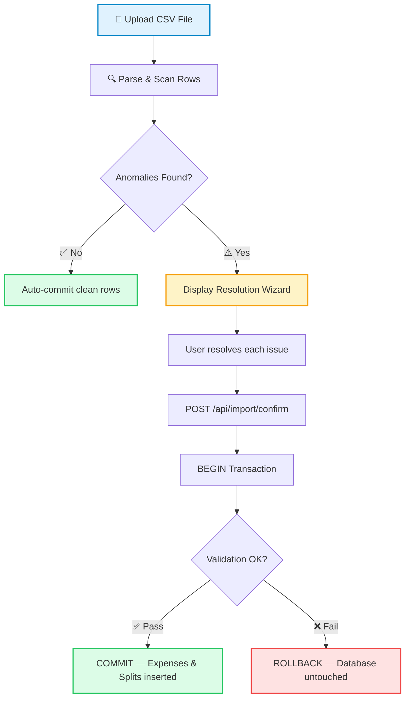
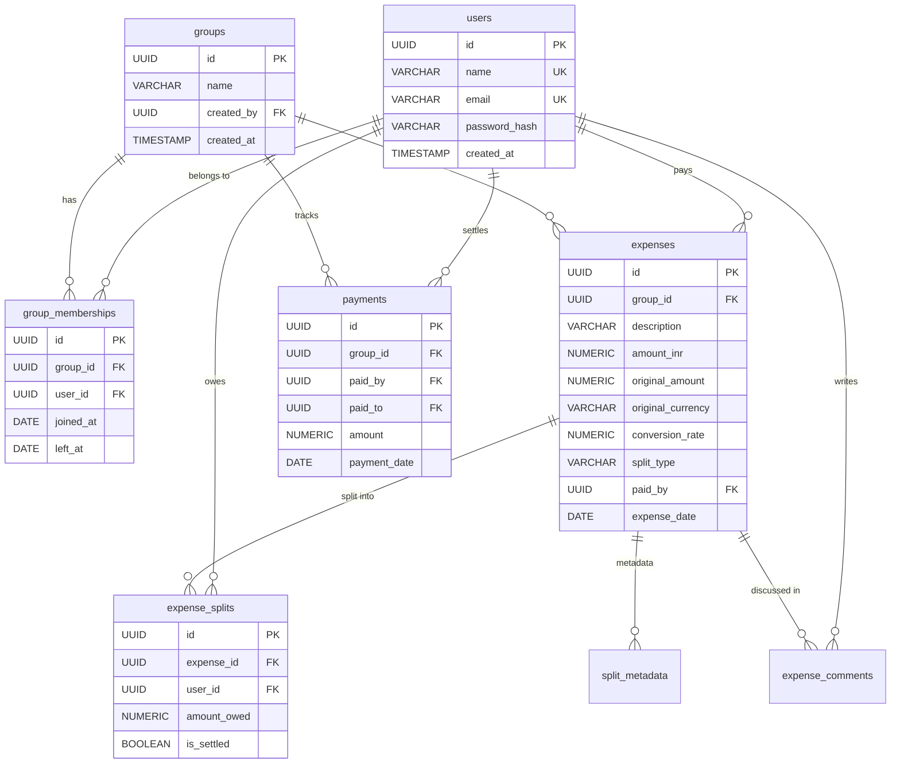

<p align="center">
  
</p>

<h1 align="center">💸 ExpenseSync</h1>

<p align="center">
  <strong>Split the damage, keep the vibes — on trips.</strong>
</p>

<p align="center">
  
  
  
  
  
  
  
</p>

<p align="center">
  <a href="#-quick-start">Quick Start</a> •
  <a href="#-features">Features</a> •
  <a href="#-tech-stack">Tech Stack</a> •
  <a href="#-csv-import-engine">CSV Import</a> •
  <a href="#-api-reference">API</a> •
  <a href="#-database-schema">Schema</a> •
  <a href="#-deployment">Deployment</a>
</p>

---

## 🎯 What is ExpenseSync?

ExpenseSync is a **full-stack shared expense management app** built for flatmates, travel groups, and anyone who splits bills. It replaces messy spreadsheets with a **transaction-safe database ledger** that supports:

- 🧮 **4 split types** — Equal, Unequal, Percentage, and Share-weight
- 💱 **Multi-currency** — Automatic USD → INR conversion
- 📅 **Membership timelines** — Track who joined/left and when
- 📤 **Smart CSV Importer** — Detects & resolves **15 data anomalies** interactively
- 🔐 **JWT Auth** — Secure email/password authentication with demo quick-switch

---

## ⚡ Quick Start

### Prerequisites

| Tool | Version |
|------|---------|
| Node.js | v20+ |
| PostgreSQL | 14+ |
| npm | 9+ |

### 🚀 One-Command Setup

```bash
# Clone the repo
git clone https://github.com/shivamyadav039/ExpenseSync.git
cd ExpenseSync

# Copy env, install, migrate, seed, and launch
cp server/.env.example server/.env && \
npm install && \
npm run --prefix server migrate && \
npm run --prefix server seed && \
npm run dev
```

> **Note:** Edit `server/.env` first if your PostgreSQL credentials differ from the defaults.

### 🌐 Access the App

| Service | URL |
|---------|-----|
| 🖥️ Frontend | `http://localhost:5173` |
| ⚙️ Backend API | `http://localhost:5001` |

### 🔑 Demo Login

The app ships with **6 seeded demo users** and a Quick Switcher for instant access:

| User | Role |
|------|------|
| Aisha | Group Creator |
| Rohan | Active Member |
| Priya | Active Member |
| Sam | Active Member |
| Meera | Active Member |
| Dev | Active Member |

> Set `DEMO_MODE=true` in `server/.env` to enable the Quick Demo Switcher on the login page.

---

## ✨ Features

### 📊 Dashboard
- Net balance overview across all groups
- Quick group creation & navigation
- Pairwise debt summary with minimized settlements

### 👥 Group Management
- Create groups and invite members
- Track **membership timelines** (join/leave dates)
- View who was active on any given expense date

### 💰 Expense Tracking
- Log expenses with **4 split types**:
  - **Equal** — Divide evenly among all participants
  - **Unequal** — Custom amount per person
  - **Percentage** — Each member pays a percentage
  - **Share** — Weighted shares (e.g., 2x, 3x shares)
- Multi-currency support (USD ↔ INR at configurable rate)
- Paginated expense history with audit trail

### 🤝 Settlements
- Smart **debt minimization algorithm** — reduces the number of transactions needed
- Record payments between members
- Full settlement history

### 💬 Expense Comments
- Discussion threads on individual expenses
- Real-time comment feed per transaction

### 📤 CSV Import Engine
- Upload historical expense CSV exports
- **15 anomaly scanners** detect data quality issues
- Interactive wizard to resolve errors before committing
- Atomic database transactions — all-or-nothing imports

---

## 🛠️ Tech Stack

### Architecture

```
┌─────────────────────────────────────────────────────┐
│                    Client (SPA)                     │
│         React 18 • Vite • Tailwind CSS              │
│              Axios • React Router                   │
└───────────────────────┬─────────────────────────────┘
                        │ REST API (JWT Auth)
┌───────────────────────▼─────────────────────────────┐
│                  Server (API)                        │
│       Express.js • csv-parser • multer               │
│         bcryptjs • jsonwebtoken                      │
└───────────────────────┬─────────────────────────────┘
                        │ pg (node-postgres)
┌───────────────────────▼─────────────────────────────┐
│              PostgreSQL Database                     │
│     Transactions • pgcrypto • NUMERIC(12,2)          │
└─────────────────────────────────────────────────────┘
```

### Stack Breakdown

| Layer | Technology | Purpose |
|-------|-----------|---------|
| **Frontend** | React 18 | Component-based UI |
| | Vite 8 | Lightning-fast HMR & bundling |
| | Tailwind CSS | Utility-first styling |
| | Lucide React | Lightweight SVG icons |
| | Axios | HTTP client with interceptors |
| **Backend** | Express.js | REST API routing |
| | csv-parser | Stream-based CSV processing |
| | multer | In-memory file uploads |
| | bcryptjs | Password hashing |
| | jsonwebtoken | Stateless JWT sessions |
| **Database** | PostgreSQL | Relational data with ACID transactions |
| | pg | Connection pooling & transactions |
| **Testing** | Vitest | Unit tests for split calculations |
| | Supertest | API endpoint integration tests |

---

## 📤 CSV Import Engine

The import engine is the flagship feature — a multi-step wizard that scans uploaded CSV files for **15 distinct anomalies** and lets users resolve them interactively before committing to the database.

### Import Flow


```mermaid
graph TD
    A["📁 Upload CSV File"] --> B["🔍 Parse & Scan Rows"]
    B --> C{"Anomalies Found?"}
    
    C -- "✅ No" --> D["Auto-commit clean rows"]
    C -- "⚠️ Yes" --> E["Display Resolution Wizard"]
    
    E --> F["User resolves each issue"]
    F --> G["POST /api/import/confirm"]
    
    G --> H["BEGIN Transaction"]
    H --> I{"Validation OK?"}
    
    I -- "✅ Pass" --> J["COMMIT — Expenses & Splits inserted"]
    I -- "❌ Fail" --> K["ROLLBACK — Database untouched"]
    
    style A fill:#e0f2fe,stroke:#0284c7,stroke-width:2px,color:#333
    style D fill:#dcfce7,stroke:#22c55e,stroke-width:2px,color:#333
    style J fill:#dcfce7,stroke:#22c55e,stroke-width:2px,color:#333
    style K fill:#fee2e2,stroke:#ef4444,stroke-width:2px,color:#333
    style E fill:#fef3c7,stroke:#f59e0b,stroke-width:2px,color:#333
```

### The 15 Anomaly Scanners

| # | Anomaly | Severity | Resolution |
|---|---------|----------|------------|
| 1 | **Duplicate Identical** | ⚠️ Warning | Skip or Keep Both |
| 2 | **Conflicting Duplicate** | ⚠️ Warning | Keep Original / New / Both |
| 3 | **Messy Numbers** | ⚠️ Warning | Auto-fix: strip `"1,200"` → `1200.00` |
| 4 | **Inconsistent Casing** | ⚠️ Warning | Auto-fix: normalize to DB spelling |
| 5 | **Typos / Alternate Names** | 🚫 Error | Map to member, Add new, or Skip |
| 6 | **Missing Payer** | 🚫 Error | Assign payer or Skip |
| 7 | **Settlement Mixed In** | ⚠️ Warning | Import as Settlement or Expense |
| 8 | **Invalid Percentages (≠100%)** | 🚫 Error | Normalize weights or Skip |
| 9 | **Non-Group Member** | 🚫 Error | Add to group or Exclude |
| 10 | **Negative Amount** | ⚠️ Warning | Auto-fix: treat as refund credit |
| 11 | **Messy Date Format** | ⚠️ Warning | Auto-fix or manual date pick |
| 12 | **Missing Currency** | ⚠️ Warning | Auto-fix: default to INR |
| 13 | **Zero Amount** | ⚠️ Warning | Skip or import zero-value |
| 14 | **Membership Mismatch** | ⚠️ Warning | Keep, Exclude, or Skip row |
| 15 | **Split Details on Equal** | ⚠️ Warning | Auto-fix: ignore weights |

---

## 📡 API Reference

### 🔐 Authentication

| Method | Endpoint | Description |
|--------|----------|-------------|
| `POST` | `/api/auth/register` | Create new account |
| `POST` | `/api/auth/login` | Login with email/password |
| `GET` | `/api/auth/me` | Get current user |
| `GET` | `/api/auth/users` | List all users |

### 👥 Groups & Members

| Method | Endpoint | Description |
|--------|----------|-------------|
| `GET` | `/api/groups` | List user's groups |
| `POST` | `/api/groups` | Create a new group |
| `GET` | `/api/groups/:id/members` | Get group members with timelines |
| `POST` | `/api/groups/:id/members` | Add member to group |

### 💰 Expenses & Payments

| Method | Endpoint | Description |
|--------|----------|-------------|
| `GET` | `/api/groups/:id/expenses` | Paginated expense list |
| `POST` | `/api/expenses` | Create expense with splits |
| `GET` | `/api/groups/:id/balances` | Net balances & optimized debts |
| `POST` | `/api/payments` | Record a settlement |
| `GET` | `/api/expenses/:id/comments` | Get expense comments |
| `POST` | `/api/expenses/:id/comments` | Add a comment |

### 📤 CSV Import

| Method | Endpoint | Description |
|--------|----------|-------------|
| `POST` | `/api/import/parse` | Upload & scan CSV for anomalies |
| `POST` | `/api/import/confirm` | Confirm resolutions & commit import |

---

## 🗄️ Database Schema


```mermaid
erDiagram
    users ||--o{ group_memberships : "belongs to"
    users ||--o{ expenses : "pays"
    users ||--o{ expense_splits : "owes"
    users ||--o{ payments : "settles"
    users ||--o{ expense_comments : "writes"
    
    groups ||--o{ group_memberships : "has"
    groups ||--o{ expenses : "contains"
    groups ||--o{ payments : "tracks"
    
    expenses ||--o{ expense_splits : "split into"
    expenses ||--o{ split_metadata : "metadata"
    expenses ||--o{ expense_comments : "discussed in"

    users {
        UUID id PK
        VARCHAR name UK
        VARCHAR email UK
        VARCHAR password_hash
        TIMESTAMP created_at
    }
    
    groups {
        UUID id PK
        VARCHAR name
        UUID created_by FK
        TIMESTAMP created_at
    }
    
    group_memberships {
        UUID id PK
        UUID group_id FK
        UUID user_id FK
        DATE joined_at
        DATE left_at
    }
    
    expenses {
        UUID id PK
        UUID group_id FK
        VARCHAR description
        NUMERIC amount_inr
        NUMERIC original_amount
        VARCHAR original_currency
        NUMERIC conversion_rate
        VARCHAR split_type
        UUID paid_by FK
        DATE expense_date
    }
    
    expense_splits {
        UUID id PK
        UUID expense_id FK
        UUID user_id FK
        NUMERIC amount_owed
        BOOLEAN is_settled
    }
    
    payments {
        UUID id PK
        UUID group_id FK
        UUID paid_by FK
        UUID paid_to FK
        NUMERIC amount
        DATE payment_date
    }
```

### Key Constraints

- **Division Precision:** All amounts stored as `NUMERIC(12,2)` — remainder cents assigned to last participant
- **Timeline Validation:** Payers and participants must have active membership on expense date
- **Transaction Safety:** Bulk imports wrapped in `BEGIN...COMMIT` — any failure triggers full `ROLLBACK`

---

## 🚀 Deployment

### Vercel + Neon (Production)

1. **Database:** Create a PostgreSQL instance on [Neon](https://neon.tech/) or Supabase
2. **Run migrations** against production DB:
   ```bash
   npm run --prefix server migrate && npm run --prefix server seed
   ```
3. **Deploy to Vercel:**
   - Connect your GitHub repo
   - Set Root Directory to `./`
   - Build Command: `npm run build`
   - Output Directory: `client/dist`

4. **Environment Variables on Vercel:**

   | Variable | Value |
   |----------|-------|
   | `DATABASE_URL` | Your Neon connection string |
   | `JWT_SECRET` | Secure random string |
   | `NODE_ENV` | `production` |
   | `USD_TO_INR_RATE` | `84` |

---

## 🧪 Testing

```bash
# Run unit tests
npm run --prefix server test

# Run tests in watch mode
npm run --prefix server test:watch
```

**Test coverage includes:**
- ✅ Split calculation accuracy (equal, unequal, percentage, share)
- ✅ CSV anomaly detection for all 15 scanner types
- ✅ Currency conversion precision
- ✅ API endpoint authorization guards
- ✅ Rounding & remainder allocation

---

## 📁 Project Structure

```
ExpenseSync/
├── client/                   # React frontend (Vite)
│   ├── src/
│   │   ├── components/       # Reusable UI components
│   │   ├── pages/            # Route-level pages
│   │   ├── context/          # Auth context provider
│   │   └── App.jsx           # Root component & routing
│   └── index.html
├── server/                   # Express.js backend
│   ├── src/
│   │   ├── db/               # Pool, migrations, seeds
│   │   ├── routes/           # API route handlers
│   │   ├── middleware/       # Auth middleware
│   │   └── services/         # Business logic (importer, splits)
│   └── index.js              # Server entry point
├── api/                      # Vercel serverless entry
│   └── index.js
├── package.json              # Root workspace config
├── vercel.json               # Vercel routing config
└── expenses_export.csv       # Sample CSV for testing imports
```

---

## 🗺️ Roadmap

- [ ] 🌍 **Live Exchange Rates** — Replace static USD/INR rate with real-time API
- [ ] 🧾 **AI Receipt Scanning** — OCR-powered auto-fill for expense forms
- [ ] 📊 **Spending Analytics** — Charts for category breakdown, monthly trends, balance history
- [ ] 💳 **Payment Integration** — Settle up via Razorpay / Stripe sandbox
- [ ] 🔔 **Real-time Notifications** — WebSocket alerts for new expenses & settlements

---

## 🏗️ Architecture Decisions

| Decision | Rationale | Trade-off |
|----------|-----------|-----------|
| **Single serverless function** | Avoids per-endpoint cold start overhead | Slightly larger lambda bundle |
| **In-memory file parsing** | Compatible with Vercel's read-only filesystem | Max upload ~50MB |
| **Manual migrations** | Prevents cold-start deadlocks on Vercel | Requires pre-deploy step |
| **Fixed exchange rate** | Eliminates external API dependency | Stale rates until roadmap item ships |

---

## 🤝 Contributing

1. Fork the repository
2. Create your feature branch: `git checkout -b feature/amazing-feature`
3. Commit your changes: `git commit -m 'Add amazing feature'`
4. Push to the branch: `git push origin feature/amazing-feature`
5. Open a Pull Request

---

## 📜 License

This project is open source and available under the [MIT License](LICENSE).

---

<p align="center">
  Built with ❤️ by <a href="https://github.com/shivamyadav039">Shivam Yadav</a>
</p>

<p align="center">
  <sub>Developed with assistance from <strong>Antigravity</strong> — an agentic AI coding assistant by Google DeepMind</sub>
</p>
